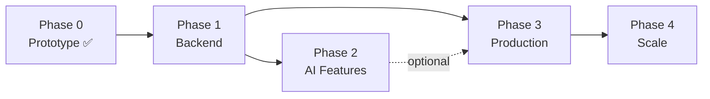

# 🚀 Development Phases — GenericMed Help

> **Purpose:** Master execution plan broken into phases with milestones, deliverables, and acceptance criteria.
> AI assistants **must** reference this file to understand what phase the project is in and what to build next.

---

## Phase Overview

```
Phase 0  ██████████████████████████████  COMPLETE    — Prototype & Frontend Demo
Phase 1  ░░░░░░░░░░░░░░░░░░░░░░░░░░░░░░  NOT STARTED — Backend Foundation
Phase 2  ░░░░░░░░░░░░░░░░░░░░░░░░░░░░░░  NOT STARTED — AI-Powered Features
Phase 3  ░░░░░░░░░░░░░░░░░░░░░░░░░░░░░░  NOT STARTED — Production Readiness
Phase 4  ░░░░░░░░░░░░░░░░░░░░░░░░░░░░░░  NOT STARTED — Scale & Localization
```

| Phase | Name                      | Status         | Dependencies     |
|-------|---------------------------|----------------|------------------|
| 0     | Prototype & Frontend Demo | ✅ Complete     | None             |
| 1     | Backend Foundation        | 🔲 Not Started | Phase 0          |
| 2     | AI-Powered Features       | 🔲 Not Started | Phase 1          |
| 3     | Production Readiness      | 🔲 Not Started | Phase 1          |
| 4     | Scale & Localization      | 🔲 Not Started | Phase 3          |

> **Current Phase:** Phase 0 — Complete. Ready to begin **Phase 1**.

---

## Phase 0 — Prototype & Frontend Demo ✅

> **Goal:** Build a complete, interactive frontend prototype with mock data to validate the product concept and user experience.

**Status:** `COMPLETE` | **Completed:** 2026-09-08

### Deliverables

- [x] Project scaffolding (Vite + React + TypeScript + Tailwind v4)
- [x] Design system and theme tokens (`src/index.css`)
- [x] TypeScript domain model (10 interfaces/types in `types.ts`)
- [x] Comprehensive mock data (`mockData.ts`)
- [x] 9 functional screens with full UI

### Screens Delivered

| Screen                 | File                          | Status |
|------------------------|-------------------------------|--------|
| Home / Landing         | `App.tsx`                     | ✅ Done |
| Drug Detail            | `DrugDetailScreen.tsx`        | ✅ Done |
| Catalog Search         | `CatalogSearchScreen.tsx`     | ✅ Done |
| Compare Offers         | `CompareOffersScreen.tsx`     | ✅ Done |
| Cart & Checkout        | `CartCheckoutScreen.tsx`      | ✅ Done |
| Order Tracking         | `OrderTrackingScreen.tsx`     | ✅ Done |
| Partner Portal         | `PartnerPortal.tsx`           | ✅ Done |
| Architecture View      | `ArchitectureView.tsx`        | ✅ Done |
| Auth (Login/Register)  | `AuthScreen.tsx`              | ✅ Done |

### Acceptance Criteria — All Met

- [x] All 9 screens render without errors.
- [x] Medicine variant matrix (strength × form × pack) is interactive.
- [x] Generic vs. branded price comparison displays savings percentage.
- [x] Bioequivalence data (dissolution, bioavailability) is visible.
- [x] Multi-pharmacy offer comparison works.
- [x] Cart and checkout flow is functional (mock).
- [x] Mobile and desktop view toggle works.
- [x] Toast notifications display correctly.

---

## Phase 1 — Backend Foundation 🔲

> **Goal:** Build a real backend with database, authentication, and REST API to replace all mock data with live data.

**Status:** `NOT STARTED` | **Estimated Duration:** 3–4 weeks

### Milestone 1.1 — Server Setup & Database

- [ ] Initialize Express.js server in `server/` directory
- [ ] Configure TypeScript for server-side code (`server/tsconfig.json`)
- [ ] Set up PostgreSQL database (or MongoDB — decide and log in `decisions.md`)
- [ ] Create database migration scripts
- [ ] Implement connection pooling and error handling
- [ ] Set up environment variable management (expand `.env.example`)

**Files to Create:**
```
server/
├── index.ts                 # Express entry point
├── tsconfig.json            # Server-side TS config
├── config/
│   └── database.ts          # DB connection config
├── middleware/
│   ├── auth.ts              # JWT authentication middleware
│   ├── errorHandler.ts      # Global error handler
│   └── validation.ts        # Request validation
└── ...
```

**Acceptance Criteria:**
- [ ] Express server starts on configurable port.
- [ ] Database connection is established with health check endpoint.
- [ ] Environment variables are validated at startup.

---

### Milestone 1.2 — Database Schema & Models

- [ ] Create `medicines` table/collection (mirrors `CanonicalMedicine` interface)
- [ ] Create `pharmacies` table (pharmacy info, location, license)
- [ ] Create `pharmacy_offers` table (price, delivery, stock per medicine)
- [ ] Create `users` table (multi-role: patient, doctor, pharmacist)
- [ ] Create `orders` table (status, items, delivery, payment)
- [ ] Create `cart_items` table (user → medicine → variant → offer)
- [ ] Seed database with existing mock data from `mockData.ts`
- [ ] Add database indexes for search performance

**Files to Create:**
```
server/
├── models/
│   ├── Medicine.ts
│   ├── Pharmacy.ts
│   ├── PharmacyOffer.ts
│   ├── User.ts
│   ├── Order.ts
│   └── CartItem.ts
├── migrations/
│   ├── 001_create_medicines.ts
│   ├── 002_create_pharmacies.ts
│   ├── 003_create_users.ts
│   ├── 004_create_orders.ts
│   └── 005_create_cart_items.ts
└── seeds/
    └── seedMockData.ts
```

**Acceptance Criteria:**
- [ ] All tables created with proper relationships and constraints.
- [ ] Seed script populates DB with the existing mock data.
- [ ] Schema matches the TypeScript interfaces in `src/types.ts`.

---

### Milestone 1.3 — REST API Endpoints

- [ ] `GET /api/medicines` — List medicines (paginated, filterable)
- [ ] `GET /api/medicines/:id` — Get medicine detail
- [ ] `GET /api/medicines/search?q=` — Full-text search by name/salt
- [ ] `GET /api/medicines/:id/offers` — Get pharmacy offers for a medicine
- [ ] `POST /api/cart` — Add item to user's cart
- [ ] `GET /api/cart` — Get user's cart
- [ ] `PUT /api/cart/:itemId` — Update cart item quantity
- [ ] `DELETE /api/cart/:itemId` — Remove from cart
- [ ] `POST /api/orders` — Place order (with idempotency key)
- [ ] `GET /api/orders/:id` — Get order detail
- [ ] `GET /api/orders/:id/tracking` — Get tracking status
- [ ] `GET /api/user/profile` — Get authenticated user's profile

**Files to Create:**
```
server/
├── routes/
│   ├── medicines.ts
│   ├── cart.ts
│   ├── orders.ts
│   └── users.ts
├── controllers/
│   ├── medicineController.ts
│   ├── cartController.ts
│   ├── orderController.ts
│   └── userController.ts
└── services/
    ├── medicineService.ts
    ├── cartService.ts
    ├── orderService.ts
    └── userService.ts
```

**Acceptance Criteria:**
- [ ] All endpoints return proper JSON responses with correct HTTP status codes.
- [ ] Pagination works (`?page=1&limit=20`).
- [ ] Error responses follow a consistent format: `{ error: string, code: string }`.
- [ ] Endpoints are documented (inline or Swagger).

---

### Milestone 1.4 — Authentication System

- [ ] Implement user registration (`POST /api/auth/register`)
- [ ] Implement user login with JWT (`POST /api/auth/login`)
- [ ] Implement JWT refresh token flow
- [ ] Add password hashing with bcrypt
- [ ] Create auth middleware for protected routes
- [ ] Connect `AuthScreen.tsx` to real API endpoints
- [ ] Implement role-based access control (patient, doctor, pharmacist)

**Acceptance Criteria:**
- [ ] Users can register with email, phone, name, and role.
- [ ] Users can log in and receive a JWT token.
- [ ] Protected routes reject unauthenticated requests with 401.
- [ ] Passwords are never stored in plain text.
- [ ] Frontend auth flow works end-to-end.

---

### Milestone 1.5 — Frontend API Integration

- [ ] Create API client module (`src/api/client.ts`) with base URL config
- [ ] Replace `MEDICINES` import in `App.tsx` with API fetch
- [ ] Replace `PHARMACY_OFFERS` import with API fetch
- [ ] Connect cart screen to cart API endpoints
- [ ] Connect checkout to order placement API
- [ ] Connect order tracking to order API
- [ ] Add loading states and error handling to all screens
- [ ] Add retry logic and offline state detection

**Files to Create:**
```
src/
├── api/
│   ├── client.ts            # Axios/fetch wrapper with auth headers
│   ├── medicines.ts         # Medicine API functions
│   ├── cart.ts              # Cart API functions
│   ├── orders.ts            # Order API functions
│   └── auth.ts              # Auth API functions
└── hooks/
    ├── useMedicines.ts      # Data fetching hook for medicines
    ├── useCart.ts            # Cart state hook
    └── useAuth.ts           # Authentication hook
```

**Acceptance Criteria:**
- [ ] All screens load data from the API instead of mock imports.
- [ ] Loading spinners display during API calls.
- [ ] Error states display user-friendly messages.
- [ ] `src/data/mockData.ts` is no longer imported in any component.

---

### Phase 1 — Exit Criteria

- [ ] All 12+ API endpoints functional and tested.
- [ ] Database seeded with realistic data.
- [ ] Frontend fully connected to backend (zero mock data imports).
- [ ] Authentication works end-to-end.
- [ ] `decisions.md` updated with database and auth decisions.
- [ ] `changelog.md` updated with v0.2.0 entry.
- [ ] `memory.md` updated with completed features and API docs.

---

## Phase 2 — AI-Powered Features 🔲

> **Goal:** Integrate Google Gemini AI to add intelligent medicine search, drug interaction checking, and smart recommendations.

**Status:** `NOT STARTED` | **Estimated Duration:** 2–3 weeks | **Depends on:** Phase 1

### Milestone 2.1 — Gemini AI Infrastructure

- [ ] Set up server-side Gemini API proxy (`server/services/geminiService.ts`)
- [ ] Implement API key management and rate limiting
- [ ] Create prompt templates for medical queries
- [ ] Add response caching to reduce API costs
- [ ] Implement error handling and fallback behavior

**Acceptance Criteria:**
- [ ] Gemini API calls work through the Express proxy.
- [ ] API key is never exposed to the client.
- [ ] Rate limiting prevents excessive API usage.

---

### Milestone 2.2 — Smart Medicine Search

- [ ] Build AI-powered search endpoint (`POST /api/ai/search`)
- [ ] Implement natural language query understanding (e.g., "headache medicine for children")
- [ ] Add synonym and salt-name matching (e.g., "Crocin" → Paracetamol IP)
- [ ] Build autocomplete suggestions UI component
- [ ] Integrate AI search into `CatalogSearchScreen.tsx`

**Acceptance Criteria:**
- [ ] Users can search by symptom, brand name, or salt name.
- [ ] AI returns relevant medicine suggestions with confidence scores.
- [ ] Search results appear within 2 seconds.

---

### Milestone 2.3 — Drug Interaction Checker

- [ ] Build interaction check endpoint (`POST /api/ai/interactions`)
- [ ] Create UI for adding multiple medicines to check interactions
- [ ] Display interaction severity (mild, moderate, severe)
- [ ] Show detailed explanations and recommendations
- [ ] Add warnings during checkout if cart items have interactions

**Acceptance Criteria:**
- [ ] Users can check interactions between 2+ medicines.
- [ ] Severe interactions trigger prominent warnings.
- [ ] Checkout flow blocks or warns on dangerous combinations.

---

### Milestone 2.4 — AI Dosage Assistant

- [ ] Build dosage recommendation endpoint (`POST /api/ai/dosage`)
- [ ] Accept patient parameters (age, weight, condition)
- [ ] Display AI-generated dosage suggestions with disclaimers
- [ ] Integrate into `DrugDetailScreen.tsx`

**Acceptance Criteria:**
- [ ] Dosage suggestions include proper medical disclaimers.
- [ ] Recommendations are clearly marked as AI-generated, not medical advice.

---

### Milestone 2.5 — Prescription OCR (Stretch Goal)

- [ ] Integrate Gemini Vision for prescription image parsing
- [ ] Build upload UI with camera/gallery picker
- [ ] Extract medicine names, dosages, and quantities from prescriptions
- [ ] Auto-populate search/cart from parsed prescription

**Acceptance Criteria:**
- [ ] Users can upload a prescription photo.
- [ ] AI extracts medicine names with ≥ 80% accuracy.
- [ ] Parsed results are editable before adding to cart.

---

### Phase 2 — Exit Criteria

- [ ] AI search returns relevant results for 90%+ of common medicine queries.
- [ ] Drug interaction checker covers major contraindications.
- [ ] All AI features include proper medical disclaimers.
- [ ] `decisions.md` updated with AI architecture decisions.
- [ ] `changelog.md` updated with v0.3.0 entry.

---

## Phase 3 — Production Readiness 🔲

> **Goal:** Harden the application for real users with routing, testing, error handling, performance, and deployment.

**Status:** `NOT STARTED` | **Estimated Duration:** 3–4 weeks | **Depends on:** Phase 1

### Milestone 3.1 — URL-Based Routing

- [ ] Install and configure React Router v6 (or TanStack Router)
- [ ] Map all 9 `AppScreen` values to URL paths
- [ ] Implement browser back/forward navigation
- [ ] Add deep linking support (e.g., `/medicine/paracetamol-ip`)
- [ ] Handle 404 / unknown routes
- [ ] Update `decisions.md` with routing decision (supersedes DEC-006)

**Route Plan:**

| URL Path                     | Screen               |
|------------------------------|-----------------------|
| `/`                          | Home                  |
| `/search`                    | Catalog Search        |
| `/medicine/:id`              | Drug Detail           |
| `/medicine/:id/offers`       | Compare Offers        |
| `/cart`                      | Cart & Checkout       |
| `/orders/:id`                | Order Tracking        |
| `/partner`                   | Partner Portal        |
| `/architecture`              | Architecture View     |
| `/login`                     | Auth (Login)          |
| `/register`                  | Auth (Register)       |

---

### Milestone 3.2 — Error Handling & Loading States

- [ ] Create global error boundary component
- [ ] Add loading skeleton components for each screen
- [ ] Implement retry buttons for failed API calls
- [ ] Add offline detection and banner
- [ ] Implement optimistic updates for cart operations
- [ ] Add form validation (Zod or Yup) for checkout and auth

---

### Milestone 3.3 — Testing

- [ ] Set up Vitest for unit testing
- [ ] Write unit tests for business logic (price calculation, savings)
- [ ] Write component tests for critical UI flows
- [ ] Set up Playwright or Cypress for E2E tests
- [ ] Write E2E tests for: search → detail → add to cart → checkout flow
- [ ] Add test scripts to `package.json`
- [ ] Achieve ≥ 80% code coverage for business logic

---

### Milestone 3.4 — Performance Optimization

- [ ] Implement code splitting with `React.lazy()` for each screen
- [ ] Add `Suspense` boundaries with fallback loading UI
- [ ] Optimize bundle size (analyze with `vite-bundle-visualizer`)
- [ ] Add image lazy loading and optimization
- [ ] Implement API response caching (SWR or React Query)
- [ ] Optimize re-renders with `React.memo` and `useMemo`

---

### Milestone 3.5 — Deployment & CI/CD

- [ ] Set up Docker containerization (Dockerfile, docker-compose)
- [ ] Configure CI/CD pipeline (GitHub Actions)
  - Lint → Type Check → Test → Build → Deploy
- [ ] Set up staging environment
- [ ] Configure production environment variables
- [ ] Set up monitoring and error tracking (Sentry)
- [ ] Configure HTTPS and security headers
- [ ] Set up database backups

---

### Milestone 3.6 — PWA Support

- [ ] Add service worker with Workbox
- [ ] Create web app manifest (`manifest.json`)
- [ ] Add app icons (192×192, 512×512)
- [ ] Implement offline fallback page
- [ ] Add install prompt UI

---

### Phase 3 — Exit Criteria

- [ ] All routes work with browser navigation (back, forward, refresh).
- [ ] Tests pass in CI pipeline.
- [ ] Lighthouse score ≥ 90 for Performance, Accessibility, Best Practices.
- [ ] App is deployed to staging environment.
- [ ] Error tracking captures and reports frontend/backend errors.
- [ ] `changelog.md` updated with v1.0.0 entry.

---

## Phase 4 — Scale & Localization 🔲

> **Goal:** Scale the platform for a broader audience with multi-language support, dark mode, real pharmacy partnerships, and mobile app.

**Status:** `NOT STARTED` | **Estimated Duration:** 4–6 weeks | **Depends on:** Phase 3

### Milestone 4.1 — Multi-Language Support (i18n)

- [ ] Install and configure `react-i18next`
- [ ] Extract all UI strings into translation files
- [ ] Add Hindi (हिन्दी) translations
- [ ] Add Marathi (मराठी) translations
- [ ] Add Tamil (தமிழ்) translations
- [ ] Add Telugu (తెలుగు) translations
- [ ] Add language selector to UI
- [ ] Persist language preference

---

### Milestone 4.2 — Dark Mode

- [ ] Define dark theme tokens in `@theme` block
- [ ] Implement theme toggle (system preference + manual)
- [ ] Update all components for dark mode compatibility
- [ ] Persist theme preference in localStorage
- [ ] Test contrast and readability in dark mode

---

### Milestone 4.3 — Real Pharmacy Partnerships

- [ ] Build pharmacy onboarding flow in Partner Portal
- [ ] Create pharmacy admin panel for managing offers
- [ ] Implement real-time stock updates
- [ ] Add pharmacy verification workflow (drug license, NABL cert)
- [ ] Build pharmacy analytics dashboard

---

### Milestone 4.4 — Advanced User Features

- [ ] User order history with re-order functionality
- [ ] Medicine price drop alerts (push notifications)
- [ ] Medicine reminders / adherence tracker
- [ ] Saved prescriptions and medical profile
- [ ] Bulk ordering for clinics and hospitals
- [ ] Insurance integration for copay calculation

---

### Milestone 4.5 — Mobile App (Stretch)

- [ ] Evaluate React Native vs. Capacitor vs. PWA-only
- [ ] Build mobile app shell
- [ ] Implement camera-based prescription upload
- [ ] Add push notifications
- [ ] Submit to Google Play Store and Apple App Store

---

### Phase 4 — Exit Criteria

- [ ] App available in ≥ 3 Indian languages.
- [ ] Dark mode works across all screens.
- [ ] At least 1 real pharmacy partner onboarded.
- [ ] `changelog.md` updated with v2.0.0 entry.

---

## Cross-Phase Dependencies



---

## How to Update This File

1. When starting a new phase, change its status to `🔄 In Progress`.
2. Check off milestones and tasks as they are completed.
3. When all exit criteria for a phase are met, change status to `✅ Complete` and add the completion date.
4. Log any new decisions triggered by phase work in `decisions.md`.
5. Update `memory.md` with completed features after each milestone.
6. Update `changelog.md` with the version entry for the phase.

---

> **Last Updated:** 2026-09-08
